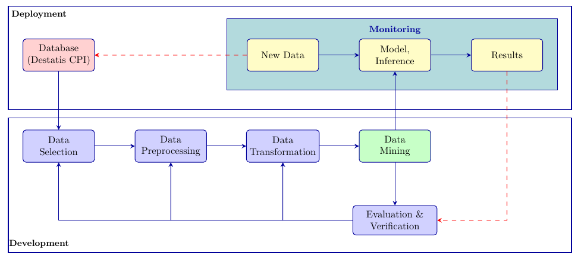
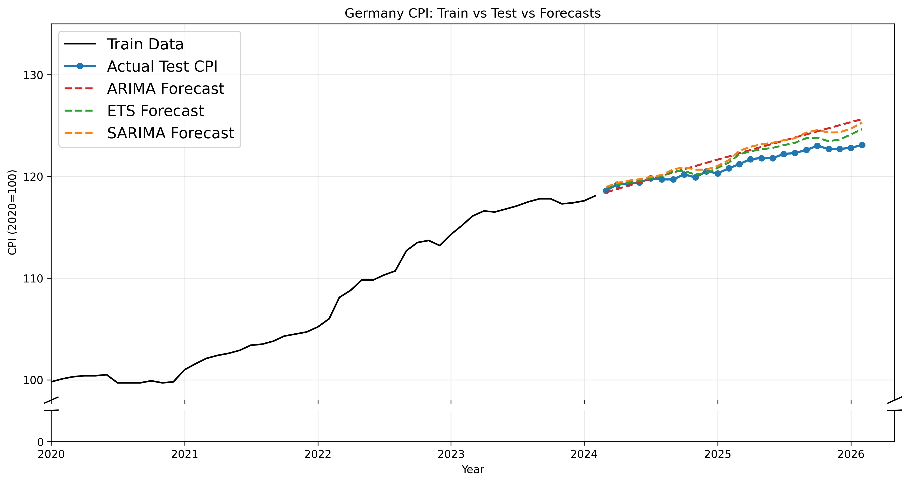
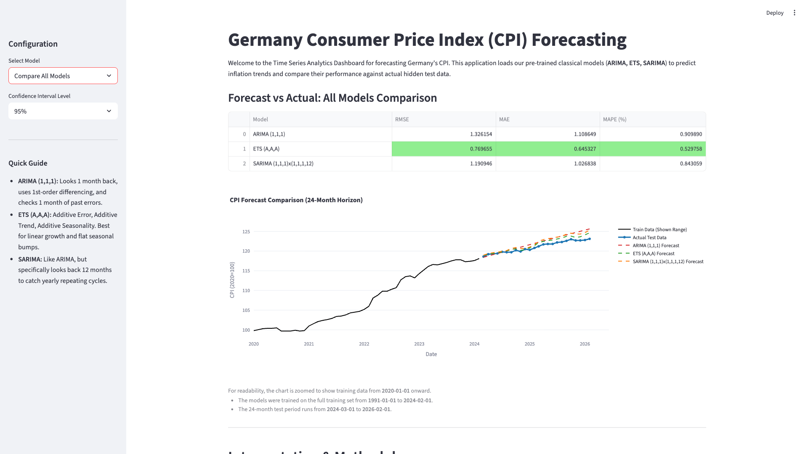

Prices do not change at a steady pace. This project uses the history of Germany's Consumer Price Index (CPI) to estimate where the index is likely to go next. It compares three well-known forecasting methods—ARIMA, ETS, and SARIMA—using the same fair test period.

The work goes beyond a notebook: it includes data preparation, model training, a Streamlit dashboard for exploring forecasts, and monitoring checks for the saved model artifacts and their accuracy.

## Dataset and evaluation design

- **Source:** Destatis GENESIS, table [61111-0002](https://www-genesis.destatis.de/datenbank/online/statistic/61111/table/61111-0002)
- **Target:** Germany's monthly CPI
- **Coverage:** January 1991 to early 2026 (422 monthly observations)
- **Split:** all observations except the final 24 months for training; final 24 months for testing
- **Metrics:** RMSE, MAE, and MAPE

The chronological holdout prevents future information from leaking into model training and reflects a real forecasting scenario.

## Methodology and deployment workflow

The implementation follows KDD from data selection through evaluation, then connects trained artifacts to a dashboard and a monitoring loop. New Destatis CPI data can be checked against the established baseline before forecasts are refreshed.



1. **Data selection:** load the monthly Destatis CPI series and retain the date and CPI fields.
2. **Preprocessing and transformation:** validate chronology and missing values, decompose the series, test stationarity with ADF, use differencing where needed, and inspect ACF/PACF behavior.
3. **Data mining:** fit ARIMA(1,1,1), ETS(A,A,A), and SARIMA(1,1,1) × (1,1,1,12).
4. **Evaluation:** compare each model on the fixed 24-month holdout with RMSE, MAE, and MAPE.
5. **Deployment and monitoring:** serve saved model artifacts in Streamlit; check required artifacts and flag metric drift against a 15% baseline threshold.

## Final results

**ETS(A,A,A) was the best-performing model** on the final 24-month test horizon. It achieved the lowest error for every evaluation metric and reduced RMSE by approximately 42% versus ARIMA and 35% versus SARIMA.

| Model | RMSE | MAE | MAPE |
| --- | ---: | ---: | ---: |
| ARIMA (1,1,1) | 1.3262 | 1.1086 | 0.9099% |
| **ETS (A,A,A)** | **0.7697** | **0.6453** | **0.5298%** |
| SARIMA (1,1,1) × (1,1,1,12) | 1.1909 | 1.0268 | 0.8431% |

In practical terms, ETS forecasts were, on average, less than one CPI index point away from the observed value during the evaluation window.



## Interactive dashboard

The Streamlit dashboard lets a user choose ARIMA, ETS, SARIMA, or a combined comparison view, inspect metric cards, and display forecast confidence intervals.



## Run locally

```bash
cd Code
./setup_env.sh
python3 src/modeling_pipeline.py
./run_dashboard.sh
```

The dashboard opens through Streamlit after the training pipeline writes the model artifacts. On Windows, use the corresponding `.bat` scripts in `Code/`.

## Repository guide

- `Code/` — data loading, modeling pipeline, Streamlit application, tests, monitoring, and saved artifacts
- `Code/plots/` — generated exploratory, forecast, and evaluation outputs
- `report/` — final technical report, figures, and KDD/deployment documentation
- `Manual/` — application and operational documentation
- `Poster/` — final project poster and supporting visuals
- `Presentations/` — proposal and literature-review materials

## Key technologies

Python · pandas · NumPy · statsmodels · scikit-learn · matplotlib · seaborn · Plotly · Streamlit · pytest
